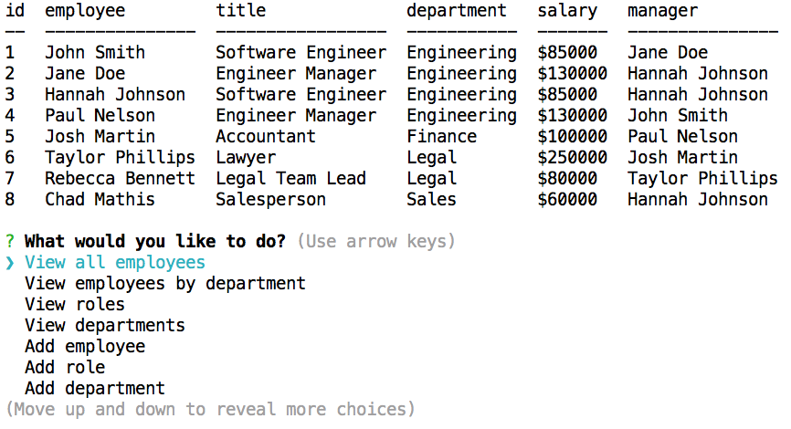

# Employee Tracker

## Description
Employee Tracker is a command line interface designed to display and update information about employees and the company. Information includes employee names, job title, salary, departments, and managers. This application is helpful for any company employee wishing to view such data. Rather than having to send and receive several emails to find the information that a user is looking for, they can instead quickly and easily view the data using Employee Tracker. 

Employee Tracker utilizes several key technologies:
* Node.js
* MySQL
* Inquirer
* Console.table
* Figlet and Chalk

For a deeper understanding, watch this a video walk-through of the application: https://drive.google.com/file/d/1sX6jj31uTKs5NSSNd7G2e27dkgZMpBvN/view
## Employee Tracker

## Table of Contents
* [Installation](#installation)
* [Usage](#usage)
* [Credits](#credits)
* [License](#license)
* [Tests](#tests)

## Installation
1. Go to the [GitHub repository for Employee Tracker](https://github.com/jeanarose/employee-tracker).
2. Click the green **Code** button.
3. Copy the SSH key.
4. In your terminal, go into the directory that you want to host Employee Tracker. 
5. Use the command **git clone [insert SSH key URL]** and click **Enter** (*Requires Git*).

## Usage
Employee tracker is a tool that companies can use to view employee and company data quickly. It can also be used to add and update company data.

## Credits
The following people contributed to the success of this application. You can view their GitHub profiles by clicking on their names:
* [Jonathan Watson](https://github.com/jonathanjwatson)
* [Peter Colella](https://github.com/petercolella)

The following resources were used to find code to make Employee Tracker function properly:
* [w3schools:](https://www.w3schools.com/sql/sql_foreignkey.asp) SQL FOREIGN KEY Constraint
* [MySQL Tutorial:](https://www.mysqltutorial.org/mysql-foreign-key/) Introduction to MySQL foreign key
* [Site Point:](https://www.sitepoint.com/mysql-foreign-keys-quicker-database-development/) How to Use MySQL Foreign Keys for Quicker Database Development
* [Stack Overflow:](https://stackoverflow.com/questions/10195451/sql-inner-join-with-3-tables) MySQL inner join with three tables
* [Stack Overflow:](https://stackoverflow.com/questions/3709560/joining-three-tables-using-mysql) Joining three tables using WHERE in MySQL
## License
Copyright (c) 2021 Jeana Rose Mathis

MIT License
    
Permission is hereby granted, free of charge, to any person obtaining a copy
of this software and associated documentation files (the "Software"), to deal
in the Software without restriction, including without limitation the rights
to use, copy, modify, merge, publish, distribute, sublicense, and/or sell
copies of the Software, and to permit persons to whom the Software is
furnished to do so, subject to the following conditions:
    
The above copyright notice and this permission notice shall be included in all
copies or substantial portions of the Software.
    
THE SOFTWARE IS PROVIDED "AS IS", WITHOUT WARRANTY OF ANY KIND, EXPRESS OR
IMPLIED, INCLUDING BUT NOT LIMITED TO THE WARRANTIES OF MERCHANTABILITY,
FITNESS FOR A PARTICULAR PURPOSE AND NONINFRINGEMENT. IN NO EVENT SHALL THE
AUTHORS OR COPYRIGHT HOLDERS BE LIABLE FOR ANY CLAIM, DAMAGES OR OTHER
LIABILITY, WHETHER IN AN ACTION OF CONTRACT, TORT OR OTHERWISE, ARISING FROM,
OUT OF OR IN CONNECTION WITH THE SOFTWARE OR THE USE OR OTHER DEALINGS IN THE
SOFTWARE. 
## Tests
Interested in testing Employee Tracker?

Check to see that all of the `add` functions work as expected:
- When you add an employee, the employee is added to the list of employees as the last ID. 
- When you add a role, the role is added to the list of roles as the last ID.
- When you add a department, the department is added to the list of departments as the last ID. If the department already exists, a message is shown letting the user know that the department already exists. 

## Questions
If you have any questions, you can contact me at jr.mathis608@gmail.com. 
You can also view my GitHub profile at https://github.com/jeanarose.
  